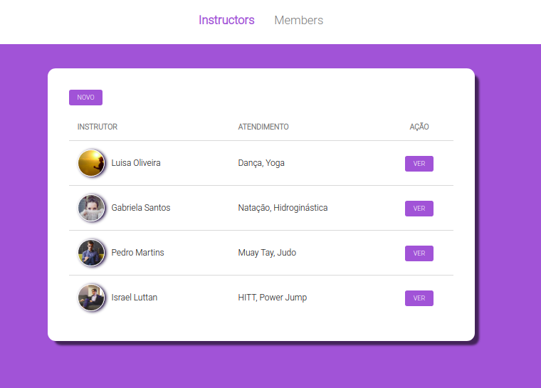
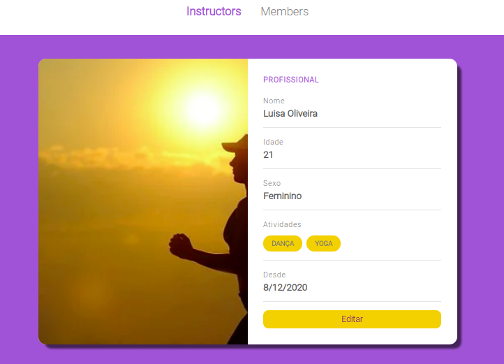
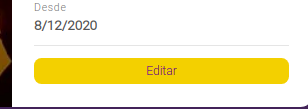
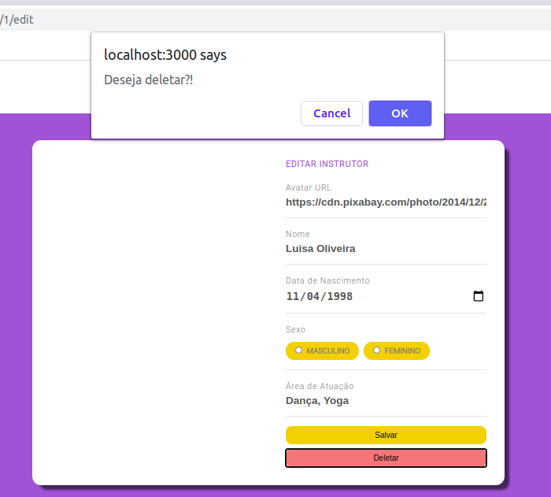
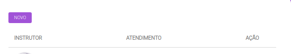
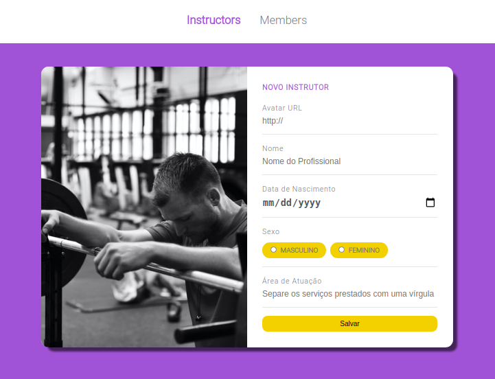
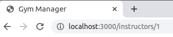
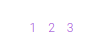
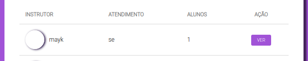
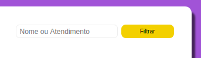

#  Controle de Academia 

## Descrição
Simples sistema de controle de academia, contendo funcionalidades para adição, edição e remoção de alunos e professores,  desenvolvida em HTML, CSS, Javascript utilizando a template engine nunjucks para reaproveitamento de código. 

## Índice
- [Requisitos](#Requisitos)
- [Instalação](#Instalação)
- [Uso](#Uso)
- [Explicação](#Explicação)
- [Erros](#Erros)


## Requisitos
- Siga os passos de instalação abaixo. 


## Instalação
- Utilizar o comando
  - No terminal, utilizar o comando: 
  ``` 
  npm install 
  ```
Obs: Ele é responsável por instalar todas as dependências de desenvolvimento utilizadas no projeto. Elas serão responsáveis pelo seu funcionamento correto.  


## Uso
Para rodar a aplicação:
- No terminal, utilize o comando:
```
npm start
```
- A aplicação deverá abrir no endereço: 

http://localhost:3000/instructors


## Explicação:

Nessa versão o projeto possui duas telas principais, a de instrutores e a de membros, que quando abertas mostram uma pequena tabela contendo suas informações consideradas mais importantes. 

<p align="center">
  
</p>

No botão ver, conseguimos entrar na página de cada professor/ aluno e fazer edições caso necessário:

<p align="center">
  
</p>

Utilizando o botão:

<p align="center">
  
</p>

Também foi desenvolvido um código para confirmar se o usuário realmente deseja excluir o membro ou professor:

<p align="center">
  
</p>

Na página inicial, é possível fazer a adição de um novo instrutor/ membro utilizando o botão novo:

<p align="center">
  
</p>

Adicionando suas informações no formulário:

<p align="center">
  
</p>

Após cadastrado, cada professor/aluno possui o seu id, por enquanto visível no endereço, por exemplo, esse instrutor foi o primeiro a ser cadastrado entao possui id número 1. 

<p align="center">
  
</p>

Selecionado a página:
<p align="center">
  
</p>

Observando a quantidade de alunos de cada professor:
<p align="center">
  
</p>


Filtro de busca nas paginas de membros e instrutores:
<p align="center">
  
</p>


## Erros
Como a aplicação ainda está em desenvolvimento e terá novas versões, é possível encontrar alguns bugs. 

Caso haja muita lentidão entre as funcionalidades, sugiro que você pare o servidor (ctrl + c) e o inicie novamente com npm start - uma nova aba abrirá.

Caso você não queira reiniciar o servidor, um ctrl + r atualizará a página e pode resolver o problema de lentidão.

Você pode acompanhar as alterações que esta fazendo no arquivo ```data.json``` na pasta raíz, ele mostrará o array com membros e instrutores. Ali você pode ver também os perfis deletados e as edições realizadas.


